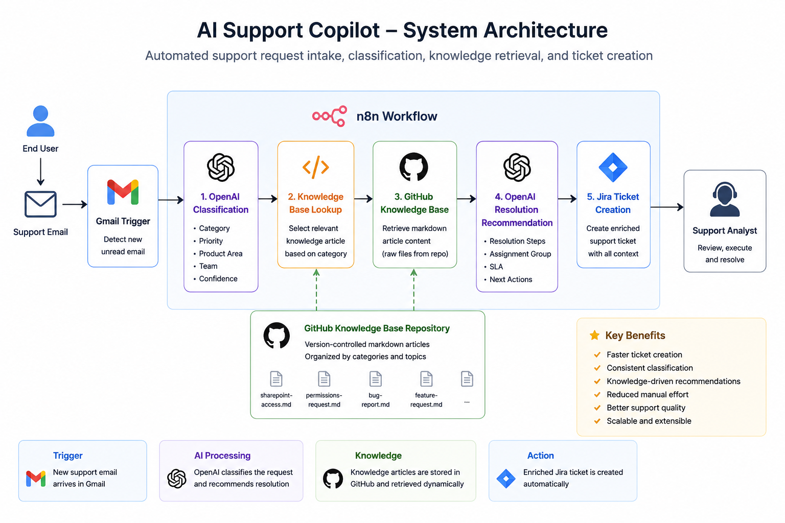

# Project 1: AI Support Copilot

## System Architecture

**Status:** ✅ Completed

---

## Purpose

An AI-powered support assistant that helps teams handle customer inquiries faster and more consistently by combining a knowledge base with an LLM-driven copilot workflow.

---

##  Artifacts

- [ ] Full implementation available during interviews or client discussions.
- [ ] Architecture diagram
- [ ] Screenshots of the workflow and UI
- [ ] Requirements document
- [ ] Knowledge base reference materials
- [ ] Results report

---

## Business Problem

Support emails require manual triage, manual knowledge search, and manual Jira ticket creation.

---

## Solution

An n8n workflow classifies emails with OpenAI, retrieves a GitHub knowledge article, generates resolution steps, and creates an enriched Jira ticket.

---

## Tech Stack

n8n, Gmail, OpenAI, GitHub, Jira

---

## Results

### Technical Outcomes

Successfully implemented an end-to-end AI-assisted support intake workflow.

The solution is capable of:

- Receiving support requests through Gmail

- Classifying requests using OpenAI

- Determining category, priority, product area, and support team

- Selecting relevant knowledge articles from GitHub

- Generating knowledge-assisted resolution recommendations

- Creating enriched Jira tickets automatically

### Project Deliverables

- Working n8n workflow (v1, v2, v3)

- GitHub-hosted knowledge base

- AI classification engine

- AI resolution recommendation engine

- Jira integration

- Requirements documentation

- Architecture documentation

- Test scenarios and validation results

### Validation Results

Successfully tested with representative support scenarios:

| Scenario | Expected Result | Status |

|-----------|-----------|-----------|

| SharePoint Access Request | Access Request classification and SharePoint knowledge article selected | Pass |

| Bug Report | Bug Report classification and bug troubleshooting article selected | Pass |

| Feature Request | Feature Request classification and feature request article selected | Pass |

### Business Impact

The solution demonstrates how AI can support service desk operations by:

- Reducing manual ticket intake activities

- Standardizing ticket enrichment

- Improving knowledge reuse

- Providing consistent troubleshooting guidance

- Preparing support workflows for future RAG and agentic capabilities

### Current Maturity

Knowledge-Assisted Support Copilot

Suitable for:

- Small businesses

- Internal support teams

- Shared service centers

- Operations teams

- Mid-sized organizations
